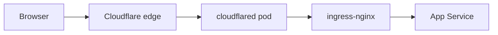
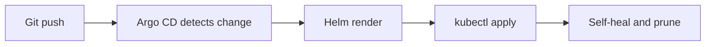

# Architecture overview

The stack has four layers: a bare-metal host running k3s, platform services that
every app depends on, the GitOps control plane, and user-facing applications.

## Stack diagram

```text
  Internet                         Tailscale tailnet
      |                                    |
      v                                    v
 +-----------+                      +-------------+
 | Cloudflare|                      |  Connector  |
 |   Tunnel  |                      | (subnet rt) |
 +-----+-----+                      +------+------+
       |                                   |
       v                                   v
 +---------------------------------------------------+
 |              k3s cluster (single node)             |
 |                                                    |
 |  +----------+  +--------+  +-------------------+  |
 |  | ingress- |  | Argo CD|  | External Secrets  |  |
 |  |  nginx   |  |        |  |                   |  |
 |  +----+-----+  +---+----+  +---------+---------+  |
 |       |            |                |            |
 |       v            v                v            |
 |  +---------+  +---------+    +-----------+      |
 |  | Gitea   |  | Homepage|    |   Vault   |      |
 |  | Wiki    |  |         |    |  (Raft)   |      |
 |  +---------+  +---------+    +-----------+      |
 +------------------------|-------------------------+
                          |
                          v
                 +------------------+
                 | PostgreSQL 16    |
                 | (native on host) |
                 +------------------+
```

## Public request path



TLS terminates at Cloudflare. The tunnel connector forwards plain HTTP to
in-cluster services. Each app exposes an Ingress with its own hostname (for example
`git.huukiet.com`, `wiki.huukiet.com`).

## GitOps reconciliation



A root Application (app-of-apps) manages child Applications for each platform and
workload. Removing an Application from `kustomization.yaml` also deletes its
Kubernetes resources.
